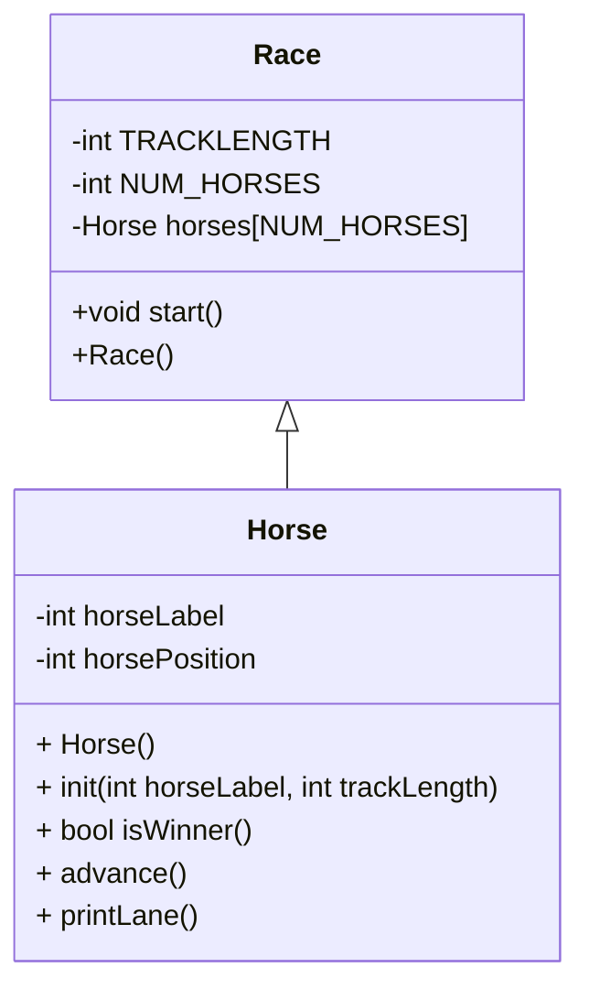

# CS121_Week5

Algorithm for HorseRace OOP

So, I am not quite sure about how to algorithm something that is object-oriented. 

I suppose we can think of it abstractly and just describe each object file and main.

Create 5 horses in an array with IDs of 0-4 integers which may as well be stored in race since thats the whole environment of the horses
Set track length. This intutitively will end up as part of the race class, but I don't know what all we'll need it for. Ah! when we write print lane, we will want to know it. 
set number of horses to 5 ;the race probably will house this number of horses variable. 

create horse objects that hold their position, and id,
seed the RNG
start the race somehow (enter from c.in.get)
end line
print start your engines

ask for "enter" before each round of play and while there is no winner

for each horse in the array 
see whether or not the horse advances()
print periods up until the horse id using horseposition and then tracklength minus horseposition
check if any of the horses' positions are equal to the tracklength (is winner()).//if this comes back and theres a winner, the end of loop will immediately come after the for loop
Take the result and set our keepgoing in race to false., ending the game

//advance method of class horse, so it knows it's operating on a specific horse and can call its attributes. 
generate random number
modulus it by 2
add that to the horse's position
return nothing

//printlane method of horse, which will be called on each horse and print the track with the horse on it, using the horse's id, its position, and the tracklength
print periods times horse position
print horse label
print (track length minus horseposition) periods

//bool isWinner() I'd have this belong to horse so that we have access to the horse's position, but the data of keep going has to be stored in the race or main, and in the algorithm, we are currently in race. However, we are accessing the variables that are used in start, so it needs to be in race. It could go in either, but it has to be called either being passed info about a horse, or on a horse, so I will choose the latter, and we can accept keepGoing as a return and build the end of the game around that. . 
if track length = horse position, 
    set bool horselocal keepgoing to false
    print that the current horse.horselabel won the race (technically two could be printed at winning)
    return the false keepgoing

Algo more refined

class Horse{
      -int horseLabel
      -int horsePosition 
      + Horse()
      + init(int horseLabel, int trackLength)   
      + bool isWinner()
      + advance()
      + printLane()

class Race{
      -int TRACKLENGTH
      -int NUM_HORSES
      -Horse horses[NUM_HORSES]
      +void start()
      +Race()
    }

Class horse 

Horse() # Initializes a horse
Horse.init(int horselabel, trackLength)

