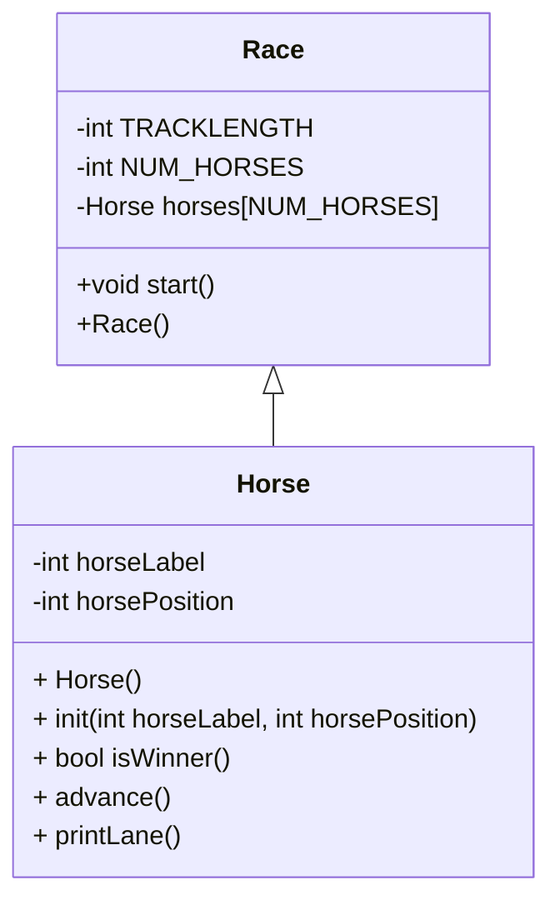

# CS121_Week5

Hello World, What a lovely day it is in computer science land. I wanna make a game, but I don't know what we will have to edit tomorrow, so I'm going to make my own little OOP system here

