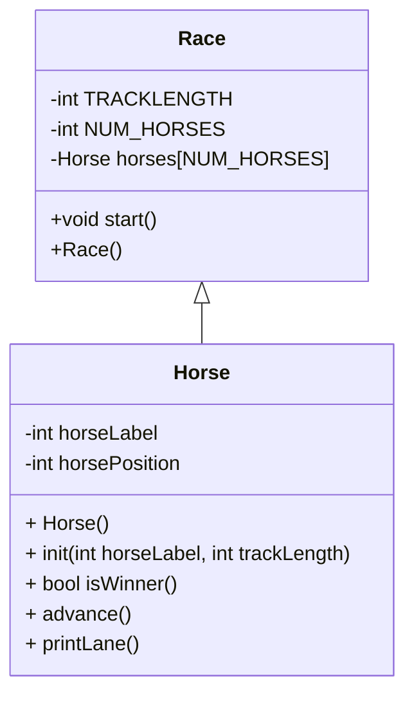

# CS121_Week5





Algorithm for HorseRace OOP
```
Create 5 horses in an array with IDs of 0-4 integers
Set track length. 
set number of horses to 5 ;

create horse objects that hold their position, and id,
seed the RNG
start the race somehow (enter from c.in.get)
end line
print start your engines

call start()

//start running inside of class Race
for each horse
initialize id and tracklength as tracklength from Race class
while there is no winner
    ask for "enter" before each round of play  
    for each horse in the array 
        see whether or not the horse advances()
        print the horse's lane(printlane())
        check if any of the horses (is winner()).
        if result is false
            Take the result 
            set our keepgoing in race to result 

//advance method of class horse, so it knows it's operating on a specific horse and can call its attributes. 
    generate random number
    modulus it by 2
    add that to the horse's position
    return nothing

//void printlane method of horse, which will be called on each horse and print the track with the horse on it, using the horse's id, its position, and the tracklength
    print periods times horse position
    print horse label
    print (track length minus horseposition) periods

//bool isWinner() I'd have this belong to horse so that we have access to the horse's position, and we can return a bool back into race, which will be where the while loop is stored. 
initialize local keepgoing
if track length = horse position, 
    set bool horse-local keepgoing to false
    print that the current horse.horselabel won the race (technically two could be printed at winning)
    else
    set keepgoing to true
return keepgoing


```

